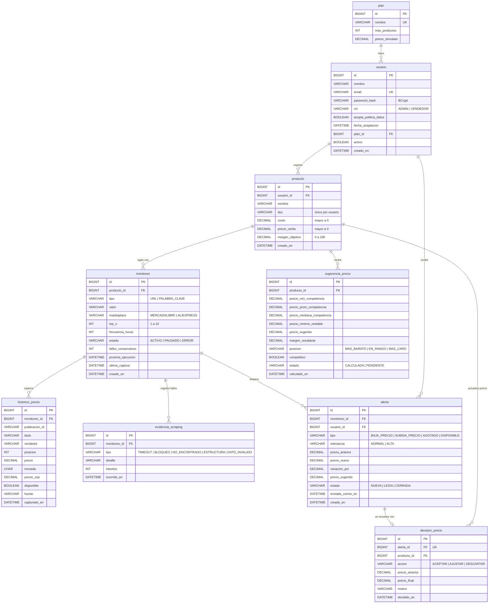

# Modelo de datos de Trendly

_SCRUM-29 · Responsable: Raquel López._ El esquema se crea con Flyway en [`backend/src/main/resources/db/migration`](../backend/src/main/resources/db/migration): `V1__esquema_inicial.sql` (tablas) y `V2__datos_iniciales.sql` (planes y administrador). Imagen: [`modelo-datos.png`](modelo-datos.png).

## Decisiones de diseño

- **Enumerados como `VARCHAR` + `CHECK`**, no `ENUM` de MySQL: se mapean directo con `@Enumerated(EnumType.STRING)` y agregar un valor solo exige una migración nueva que cambie el `CHECK`.
- **Montos en `DECIMAL(14,2)`** (nunca `FLOAT`), en COP. `historico_precio` guarda también el precio y la moneda originales. Los porcentajes (`margen_objetivo`, `variacion_pct`) van de 0 a 100.
- **Fechas en UTC** con `DATETIME(6)`. El contenedor de MySQL y Hibernate están configurados en UTC.
- **Borrado en cascada** desde `usuario` y `producto`: al borrar un producto se van sus monitoreos, histórico, alertas y decisiones.
- `alerta.usuario_id` está desnormalizado (se podría llegar por monitoreo → producto → usuario) para que la bandeja del vendedor (`GET /alertas?estado=`) sea una sola consulta con índice.
- `decision_precio.alerta_id` es único: cada alerta se decide una sola vez.
- **Índices** para las consultas frecuentes: monitoreos vencidos (`estado, proxima_ejecucion`), histórico por monitoreo y fecha, y alertas por usuario y estado.

## Pendiente para migraciones futuras

No van en V1 porque sus historias aún no definen los campos. Cada una se agrega como `V3__...`, `V4__...` (nunca se edita una migración ya integrada):

- Ciclos de recolección (SCRUM-39): inicio, fin, procesados, exitosos y fallidos.
- Reglas de alerta por vendedor (SCRUM-47): umbral de variación (5 % por defecto) y avisos de disponibilidad.
- Comisión por marketplace, configurable por el administrador (SCRUM-46).
- Dispositivos para notificaciones push (SCRUM-52).
- Caché de la TRM (SCRUM-42).

## Datos iniciales

| Tabla | Datos |
|---|---|
| `plan` | Gratuito (10 productos, $0) y Pro (100 productos, $49.900 simulado) |
| `usuario` | `admin@trendly.co` / `Trendly123`, rol ADMIN, plan Pro. Es el mismo del API simulado del frontend. |
